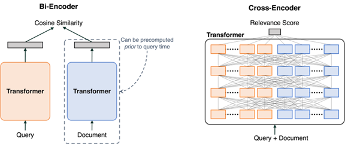

# Researching the Integration of Predictive Maintenance with Generative AI Chatbot  
---
# บทนำ

การศึกษานี้มุ่งศึกษาการบูรณาการระหว่างระบบซ่อมบำรุงเชิงพยากรณ์และการเฝ้าติดตามสภาพเครื่องจักรในโรงงานอุตสาหกรรม (Predictive Maintenance and Machine Monitoring Solution | The Soothsayer) ร่วมกับระบบ Generative AI Chatbot เพื่อพัฒนาประสิทธิภาพในการบำรุงรักษาเครื่องจักรอุตสาหกรรม

การศึกษาครั้งนี้มุ่งประเมินศักยภาพของการผสานเทคโนโลยีโมเดลภาษาขนาดใหญ่ (Large Language Models: LLMs) ร่วมกับเทคนิค Retrieval-Augmented Generation (RAG) ในการพัฒนาระบบผู้ช่วยอัจฉริยะสำหรับงานซ่อมบำรุงเชิงพยากรณ์ โดยระบบที่พัฒนาขึ้นจะสามารถ:

1. วิเคราะห์ข้อมูลสุขภาพเครื่องจักรและแนวโน้มการเสื่อมสภาพได้อย่างแม่นยำ 
2. ให้คำแนะนำที่เป็นประโยชน์แก่วิศวกรในการวางแผนการซ่อมบำรุง
3. สนับสนุนการตัดสินใจในการบริหารจัดการทรัพยากรเครื่องจักรอย่างมีประสิทธิภาพ

การศึกษานี้คาดหวังว่าจะเป็นแนวทางในการพัฒนาเทคโนโลยี Generative AI Chatbots ให้สามารถใช้งานได้อย่างมีประสิทธิภาพในบริบทของการซ่อมบำรุงเชิงพยากรณ์และการเฝ้าติดตามสภาพเครื่องจักรในโรงงานอุตสาหกรรม พร้อมทั้งสร้างความเข้าใจและเพิ่มประสิทธิภาพในการจัดการเครื่องจักรในอนาคต

---
# การออกแบบระบบ 


แผนภาพแสดงสถาปัตยกรรมระบบ RAG ที่มีสองส่วนหลัก:

## Preprocessing
ส่วนเตรียมข้อมูล:
- แปลงข้อมูลเครื่องจักรเป็น Corpus
- แบ่งเป็น Chunks และสร้าง Context ด้วย LLM
- สร้าง Vector Embeddings และ TF-IDF Encodings

## Runtime 
ส่วนประมวลผลแบบ Real-time:
- รับ Query และค้นหาด้วย Vector/BM25 Search
- จัดอันดับและ Reranking ผลลัพธ์
- ใช้ Generative Model สร้างคำตอบที่เหมาะสม

<!-- ### การนำไปใช้งานและประโยชน์
ระบบนี้สามารถนำไปประยุกต์ใช้ในโรงงานอุตสาหกรรมเพื่อ:
- เพิ่มประสิทธิภาพการวางแผนซ่อมบำรุง
- ลดเวลาหยุดเครื่องจักรโดยไม่ได้วางแผน
- สนับสนุนการตัดสินใจของวิศวกรด้วยข้อมูลที่แม่นยำ -->

---
# การปฏิบัติ
Repository นี้สาธิตการพัฒนาระบบ Retrieval-Augmented Generation (RAG) เเละปรับปรุงชุดความรู้ด้วย LLM สำหรับการซ่อมบำรุงเชิงพยากรณ์ ประกอบด้วยขั้นตอนหลักดังนี้

## Preprocessing
### 1. แปลงข้อมูลเครื่องจักรเป็น Corpus


**แผนภาพแสดงกระบวนการแปลงข้อมูล (Data Transformation) จากข้อมูลเครื่องจักร**

ในการสร้างชุดความรู้สำหรับ RAG จากข้อมูล **Health-Diff Scores** ที่เป็นตัวเลขโดยตรงมักไม่สามารถนำมาใช้ได้ทันที ดังนั้น กระบวนการเตรียมข้อมูลใน Repository นี้จะอธิบายวิธีการแปลงข้อมูลตัวเลขเหล่านั้นให้กลายเป็นเนื้อหาที่เหมาะสมและสามารถใช้ในระบบ RAG 

กล่อง "Convert to Content" จะทำหน้าที่แปลงข้อมูลจาก **Information about the machine** ที่เป็นลักษณะ **Health-Diff Scores** ซึ่งเป็นข้อมูลตัวเลขให้เป็นเนื้อหาที่สามารถใช้งานได้ในระบบ RAG โดยการรวบรวมข้อมูลจากแหล่งต่าง ๆ เช่น:

- **machines_status**: สถานะการทำงานของเครื่องจักร
- **machines_health**: ข้อมูลสุขภาพและการเปลี่ยนแปลง
- **all_components_health**: ข้อมูลสุขภาพและการเปลี่ยนแปลงของส่วนประกอบ
- **all_models_health**: ข้อมูลสุขภาพและการเปลี่ยนแปลงของโมเดลที่ใช้ติดตาม

ข้อมูลจากแหล่งเหล่านี้จะถูกแปลงเป็นเนื้อหาที่เหมาะสมและจัดเก็บเป็น **Corpus** เพื่อสร้างชุดข้อมูลความรู้สำหรับเครื่องจักรในระบบ RAG พร้อมทั้งเพิ่มบริบทที่จำเป็นในขั้นตอนถัดไป

กระบวนการแปลงข้อมูลใช้หลักการเขียนประโยคในรูปแบบ Subject + Verb + Object (ประธาน + กริยา + กรรม) เพื่อให้ได้ประโยคที่มีโครงสร้างชัดเจน

**ตัวอย่างข้อมูล สุขภาพและการเปลี่ยนแปลงของโมเดล TI017A6 (GG Exhaust Temp6A(ECS)) สำหรับเฝ้าติดตาม The Sale Gas Compressor:**
| MODEL_ID | MODEL_NAME                         | MODEL_TYPE | MODEL_CLASS      | COMPONENT_ID | TimeStamp                  | HEALTH | HEALTH_DIFF_DAY | HEALTH_DIFF_WEEK | HEALTH_DIFF_MONTH | RESIDUAL_DIFF_DAY | RESIDUAL_DIFF_WEEK | RESIDUAL_DIFF_MONTH |
|----------|------------------------------------|------------|------------------|--------------|---------------------------|--------|-----------------|------------------|-------------------|-------------------|--------------------|---------------------|
| 18       | TI017A6 (GG Exhaust Temp6A(ECS)) | CONDITION  | MACHINE_LEARNING | 4            | 2023-12-10 23:00:00+07:00 | 37.74  | -4.2           | -14.14          | -13.54            | 1.3               | 4.74              | 4.51               |
| ...      | [and others...]                   | ...        | ...              | ...          | ...                       | ...    | ...             | ...              | ...               | ...               | ...               | ...                |

**แปลงเป็นประโยคที่มีโครงสร้าง Subject + Verb + Object:**

```
"""
The GAS TURBINE component of Sale Gas Compressor (Tag: MACHINE_01) in the Natural Gas Processing Plant is monitored by the model TI017A6 (GG Exhaust Temp6A(ECS)), which is a CONDITION model of MACHINE_LEARNING class.
This model has a health score of 37.74%, with health changes recorded at -4.2% daily, -14.14% weekly, and -13.54% monthly. 
The residual changes are 1.3% daily, 4.74% weekly, and 4.51% monthly.
"""
```

**การแปลงข้อมูลเป็นเนื้อหาและการรวบรวมเป็น Corpus:**

ข้อมูลจากแหล่งต่าง ๆ ที่ถูกแปลงเป็นเนื้อหาจะถูกจัดระเบียบด้วยเครื่องหมาย `bullet point (*)` และรวบรวมเข้าด้วยกันในรูปแบบ **Corpus** เพื่อให้สามารถแบ่งเป็น **Chunks** ได้ง่ายในขั้นตอนถัดไป

**ตัวอย่างข้อมูล Corpus สำหรับเครื่องอัดก๊าซ The Sale Gas Compressor:**

ส่วนของ Section แสดงข้อมูลจากแหล่งต่าง ๆ
```
[Section]MACHINE DATA[Section]
* The Sale Gas Compressor (Tag: MACHINE_01) in the Natural Gas Processing Plant is currently RUNNING. It is monitored by the associated sensor SIA005A.PV, with a stop threshold set at 5500. The machine consists of 8 components and 167 models.

[Section]MACHINE HEALTH DATA[Section]
* The Sale Gas Compressor (Tag: MACHINE_01) in the Natural Gas Processing Plant has a Performance Health of 87.86% and Condition Health of 98.26%. The machine is currently in a Non-Critical status. The Performance changes are -1.92% daily, -2.21% weekly, and -0.95% monthly. The Condition changes are -0.06% daily, -0.37% weekly, and -0.35% monthly.

[Section]COMPONENT LIST[Section]
* The Sale Gas Compressor (Tag: MACHINE_01) in the Natural Gas Processing Plant consists of the following components: AIR SYSTEM, COMPRESSOR, FUEL SYSTEM, GAS TURBINE, GG LUBE OIL, MAIN LUBE OIL, POWER TURBINE , SEAL SYSTEM

[Section]ALL COMPONENT HEALTH[Section]
Here is a detailed report on the health status of each component within the Sale Gas Compressor (Tag: MACHINE_01) at the Natural Gas Processing Plant.The data reflects current Condition Health scores along with observed daily, weekly, and monthly changes. Each component's performance and stability are monitored for precision:
* The AIR SYSTEM component of Sale Gas Compressor (Tag: MACHINE_01) in the Natural Gas Processing Plant has a Condition Health of 100.0%. The Condition changes are 0.0% daily, 0.0% weekly, and 0.0% monthly.
* The COMPRESSOR component of Sale Gas Compressor (Tag: MACHINE_01) in the Natural Gas Processing Plant has a Condition Health of 99.92%. The Condition changes are 0.01% daily, 0.2% weekly, and 0.22% monthly.

* [and others...]

[Section]ALL MODEL HEALTH[Section]
This section provides a detailed analysis of the health and performance of models monitoring the components of the Sale Gas Compressor (Tag: MACHINE_01) at the Natural Gas Processing Plant.Each model is tracked for health scores and residual changes across daily, weekly, and monthly intervals:
* The COMPRESSOR component of Sale Gas Compressor (Tag: MACHINE_01) in the Natural Gas Processing Plant is monitored by the model PI009 (1st Stage Discharge Press), which is a CONDITION model of MACHINE_LEARNING class. This model has a health score of 99.57%, with health changes recorded at 0.23% daily, 0.37% weekly, and 0.5% monthly. The residual changes are -0.04% daily, -0.06% weekly, and -0.07% monthly.
* The GAS TURBINE component of Sale Gas Compressor (Tag: MACHINE_01) in the Natural Gas Processing Plant is monitored by the model TI017A6 (GG Exhaust Temp6A(ECS)), which is a CONDITION model of MACHINE_LEARNING class. This model has a health score of 37.74%, with health changes recorded at -4.2% daily, -14.14% weekly, and -13.54% monthly. The residual changes are 1.3% daily, 4.74% weekly, and 4.51% monthly.

* [and others...]
``` 

The Sale Gas Compressor: [Example Corpus](../predictive-maintenance-chatbot/data/prepared_data/PLANT_01/MACHINE_01/PLANT_01_MACHINE_01_corpus.txt)

Guide: [Machine Health Data Transformation](../predictive-maintenance-chatbot/preprocessing/numeric2content_transformation/main.ipynb)


### 2 แบ่งเป็น Chunks และสร้าง Context ด้วย LLM


**แผนภาพแสดงกระบวนการแบ่งข้อมูลและสร้างบริบท (Chunking and Context Creation)**

#### กระบวนการแบ่งข้อมูล Chunking 

กระบวนการแบ่งข้อมูลออกเป็นชิ้นส่วนย่อย (chunks) เป็นขั้นตอนสำคัญในระบบ Retrieval-Augmented Generation (RAG) โดยมีวัตถุประสงค์เพื่อจัดการข้อมูลจำนวนมากอย่างมีประสิทธิภาพ การแบ่งข้อมูลนี้ช่วยลดความซับซ้อนของการประมวลผล พร้อมเพิ่มความเร็วในการค้นหาและตอบคำถามของผู้ใช้

ใน Repository นี้ การแบ่งข้อมูลจาก **Corpus** เป็น **Chunks** ดำเนินการโดยใช้ `bullet point (*)` เพื่อรักษาความสมบูรณ์ของเนื้อหา แต่ละ **Chunk** จะมีความยาวไม่เกิน 150 Tokens โดยประมาณ

**ตัวอย่างการจัดเก็บข้อมูลของ The Sale Gas Compressor ที่ผ่านการ Chunking ในรูปแบบ JSON**
```
[
  {
    "doc_id": "PLANT_01_MACHINE_01",
    "original_uuid": "1cc0b101-a6a2-3839-90b5-2db0dc251614",
    "corpus_source": "D:\\Data_sci_internship\\Exploring Generative AI for Predictive Maintenance Applications\\predictive-maintenance-chatbot\\data\\prepared_data\\PLANT_01\\MACHINE_01\\PLANT_01_MACHINE_01_corpus.txt",
    "chunks": [
      {
        "chunk_id": "PLANT_01_MACHINE_01_chunk_0",
        "original_index": 0,
        "content": "The Sale Gas Compressor (Tag: MACHINE_01) in the Natural Gas Processing Plant is currently RUNNING. It is monitored by the associated sensor SIA005A.PV, with a stop threshold set at 5500. The machine consists of 8 components and 167 models."
      },
      {
        "chunk_id": "PLANT_01_MACHINE_01_chunk_1",
        "original_index": 1,
        "content": "The Sale Gas Compressor (Tag: MACHINE_01) in the Natural Gas Processing Plant has a Performance Health of 87.86% and Condition Health of 98.26%. The machine is currently in a Non-Critical status. The Performance changes are -1.92% daily, -2.21% weekly, and -0.95% monthly. The Condition changes are -0.06% daily, -0.37% weekly, and -0.35% monthly."
      },

      [and others...]

      {
        "chunk_id": "PLANT_01_MACHINE_01_chunk_28",
        "original_index": 28,
        "content": "The GAS TURBINE component of Sale Gas Compressor (Tag: MACHINE_01) in the Natural Gas Processing Plant is monitored by the model TI017A6 (GG Exhaust Temp6A(ECS)), which is a CONDITION model of MACHINE_LEARNING class. This model has a health score of 37.74%, with health changes recorded at -4.2% daily, -14.14% weekly, and -13.54% monthly. The residual changes are 1.3% daily, 4.74% weekly, and 4.51% monthly."
      },

      [and others...]

      ]
  }
]
```

The Sale Gas Compressor: [Example Corpus Chunking](../predictive-maintenance-chatbot/data/prepared_data/PLANT_01/MACHINE_01/PLANT_01_MACHINE_01_chunks.json)

Guide: [Corpus Chunking](../predictive-maintenance-chatbot/preprocessing/numeric2content_chunks/main.ipynb)


#### การสร้างบริบท Context Creation 

กระบวนการแบ่งข้อมูลออกเป็นชิ้นส่วนย่อย (chunks) เป็นขั้นตอนสำคัญในระบบ Retrieval-Augmented Generation (RAG) อย่างไรก็ตาม การแบ่งข้อมูลเป็น **chunks** อาจทำให้สูญเสียความต่อเนื่องของบริบทในบางกรณี ซึ่งอาจส่งผลต่อความสามารถของ Language Models (LLMs) ในการทำความเข้าใจข้อมูลที่สัมพันธ์กับคำถามของผู้ใช้

**ตัวอย่างข้อมูลที่ถูกเเบ่งออกมาจาก [The Sale Gas Compressor Corpus](../predictive-maintenance-chatbot/data/prepared_data/PLANT_01/MACHINE_01/PLANT_01_MACHINE_01_corpus.txt):**

```
"""
The GAS TURBINE component of Sale Gas Compressor (Tag: MACHINE_01) in the Natural Gas Processing Plant is monitored by the model TI017A6 (GG Exhaust Temp6A(ECS)), which is a CONDITION model of MACHINE_LEARNING class. 
This model has a health score of 37.74%, with health changes recorded at -4.2% daily, -14.14% weekly, and -13.54% monthly. 
The residual changes are 1.3% daily, 4.74% weekly, and 4.51% monthly.
"""
```

จากตัวอย่างข้อมูลข้างต้น แม้จะสามารถนำเสนอข้อมูลสุขภาพและการเปลี่ยนแปลงของโมเดล **TI017A6 (GG Exhaust Temp6A(ECS))** ได้อย่างครบถ้วน แต่สิ่งที่ยังขาดไปคือ **บริบทการวิเคราะห์ปัญหา** ที่ช่วยให้ผู้ใช้งานเข้าใจถึงความสำคัญหรือความเสี่ยงที่อาจเกิดขึ้นจากข้อมูลดังกล่าว

**บริบทการวิเคราะห์ปัญหาส่งผลต่อการค้นหาอย่างไร?**

การมีบริบทการวิเคราะห์ข้อมูลช่วยให้การค้นหามีประสิทธิภาพมากขึ้น โดยเฉพาะเมื่อผู้ใช้ต้องการข้อมูลที่เฉพาะเจาะจง เช่น การค้นหาโมเดลที่อาจเกิดความเสี่ยงในส่วนประกอบ GAS TURBINE ของ Sale Gas Compressor หากตัวอย่างข้อมูลที่ถูกแบ่งออกมาไม่มีการวิเคราะห์ถึงปัญหาหรือความเสี่ยง ผู้ใช้อาจค้นหาโมเดล TI017A6 หรือโมเดลอื่นที่เกี่ยวข้องไม่พบ เนื่องจากเนื้อหาไม่ระบุถึงลักษณะของปัญหาในบริบทที่ชัดเจน

**ตัวอย่าง:**

ในระบบจริง เครื่องจักรมีส่วนประกอบหลากหลาย และแต่ละส่วนประกอบมีโมเดลเฝ้าติดตามจำนวนมาก ผู้ใช้อาจไม่สามารถจำข้อมูลทั้งหมดหรือป้อนคำค้นหาได้อย่างถูกต้อง เช่น ชื่อโมเดล ชื่อเครื่องจักร หรือส่วนประกอบที่เกี่ยวข้อง หากไม่มีการเพิ่มบริบท ผู้ใช้จะต้องค้นหาแบบเดาสุ่ม ซึ่งลดประสิทธิภาพของระบบลงอย่างมาก

**ตัวอย่างของบริบทที่เพิ่มเข้ามา รวมกับเนื้อหาเดิม**

```
"""
<Contextualized>
The GAS TURBINE component of the Sale Gas Compressor (MACHINE_01) is experiencing significant performance degradation, with a health score of only 37.74% and rapid daily, weekly, and monthly declines of over 4%, 14%, and 13% respectively. 
The high residual changes also indicate unstable operating conditions. 
This critical component failure poses a major risk to the overall system functionality and requires immediate maintenance attention."""
</Contextualized>

<Chunk>
The GAS TURBINE component of Sale Gas Compressor (Tag: MACHINE_01) in the Natural Gas Processing Plant is monitored by the model TI017A6 (GG Exhaust Temp6A(ECS)), which is a CONDITION model of MACHINE_LEARNING class. 
This model has a health score of 37.74%, with health changes recorded at -4.2% daily, -14.14% weekly, and -13.54% monthly. 
The residual changes are 1.3% daily, 4.74% weekly, and 4.51% monthly.
</Chunk>
"""
```

จากตัวอย่างข้างต้น จะสังเกตได้ว่าการเพิ่มบริบทการวิเคราะห์ปัญหา ช่วยให้:

1. **เพิ่มความชัดเจน:** เนื้อหาสื่อสารถึงปัญหาหรือความเสี่ยงในระบบได้อย่างครบถ้วน
2. **เพิ่มความแม่นยำในการค้นหา:** ผู้ใช้งานสามารถค้นหาข้อมูลสำคัญได้ง่ายขึ้น แม้จะใช้คำค้นหาที่ไม่เฉพาะเจาะจง
3. **เพิ่มประสิทธิภาพในการตัดสินใจ:** ระบบสามารถนำเสนอข้อมูลที่ช่วยให้ผู้ใช้ตัดสินใจดำเนินการแก้ไขได้อย่างเหมาะสม เช่น การวางแผนการซ่อมบำรุง

การเพิ่มบริบทจึงเป็นองค์ประกอบสำคัญที่ช่วยให้ระบบ RAG ทำงานได้อย่างมีประสิทธิภาพสูงสุด โดยเฉพาะในงานที่ต้องจัดการข้อมูลซับซ้อนและมีความสำคัญต่อการตัดสินใจในระดับอุตสาหกรรม

**การสร้างบริบทโดยใช้ LLMs: Run Prompt for Every Chunk**

การเพิ่มบริบทการวิเคราะห์ปัญหาของเครื่องจักรในอุตสาหกรรมเป็นกระบวนการที่ต้องอาศัยความเชี่ยวชาญจากผู้เชี่ยวชาญหรือวิศวกรเพื่อให้ข้อมูลมีความครบถ้วนและชัดเจน อย่างไรก็ตาม การเตรียมข้อมูลในปริมาณมากอาจไม่สามารถพึ่งพาผู้เชี่ยวชาญได้ในทุกกรณี

ใน Repository นี้ การเพิ่มบริบทการวิเคราะห์ข้อมูลใช้ **Large Language Models (LLMs)** ร่วมกับ **Prompt Engineering** ซึ่งช่วยจำลองบทบาทของผู้เชี่ยวชาญด้านเครื่องจักรในอุตสาหกรรม LLMs ถูกนำมาใช้เพื่อวิเคราะห์และสร้างบริบทที่เหมาะสมสำหรับ **แต่ละ chunk** ของข้อมูล ทำให้ข้อมูลที่ได้มีคุณภาพสูงขึ้นและช่วยให้ระบบ Retrieval-Augmented Generation (RAG) ทำงานได้อย่างมีประสิทธิภาพมากขึ้น

**Prompt Engineering**

Prompt Engineering เป็นกระบวนการออกแบบคำสั่งหรือคำถาม (prompts) ที่ชัดเจนและมีโครงสร้าง เพื่อให้ LLMs ตอบสนองได้ตรงตามเป้าหมายที่กำหนดไว้ ในกรณีนี้ เราออกแบบ prompt ให้ LLMs ทำหน้าที่เป็นผู้เชี่ยวชาญด้านการวิเคราะห์เครื่องจักรในอุตสาหกรรม โดยเน้นให้ LLMs:

1. **วิเคราะห์สถานะของส่วนประกอบ (Component Status):** ระบุส่วนประกอบของเครื่องจักรหรือระบบที่ถูกกล่าวถึงในข้อมูล
2. **ดึงค่าประสิทธิภาพ (Performance Metrics):** สกัดและแปลความหมายของค่าประสิทธิภาพ ตัวชี้วัด หรือผลการทดสอบ
3. **ชี้ตัวบ่งชี้สุขภาพ (Health Indicators):** เน้นสิ่งผิดปกติ คำเตือน หรือรูปแบบที่น่าสนใจในข้อมูล
4. **ประเมินผลกระทบต่อการทำงาน (Operational Impact):** วิเคราะห์ผลกระทบต่อประสิทธิภาพของระบบโดยรวม
5. **ให้คำแนะนำด้านการบำรุงรักษา (Maintenance Implications):** ระบุข้อกำหนดหรือคำแนะนำในการบำรุงรักษาจากข้อมูล

ตัวอย่าง Prompt ที่ใช้ในระบบ:

```
"""
<document>
{Corpu_content}
</document>

Given the following chunk from a machine health report:
<chunk>
{chunk_content}
</chunk>

You are an AI assistant specialized in industrial equipment analysis. Analyze this text segment focusing on:

1. Component Status: Identify the specific machine components or systems being discussed
2. Performance Metrics: Extract and interpret key performance indicators, measurements, or test results
3. Health Indicators: Highlight any anomalies, warnings, or notable patterns in the data
4. Operational Impact: Assess how these findings affect the overall system functionality
5. Maintenance Implications: Note any maintenance requirements or recommendations suggested by the data

Provide a concise, technical summary (2-3 sentences) that:
- Emphasizes the most critical findings
- Uses precise technical terminology
- Connects this chunk's information to overall system health
- Highlights actionable insights for maintenance teams

Focus solely on information present in the chunk. Be specific and quantitative where possible.
Respond only with the technical summary, without any additional commentary or explanations.
"""
```

ด้วยการใช้ Prompt Engineering ในลักษณะนี้ LLMs สามารถสร้างบริบทที่เจาะลึกและแม่นยำสำหรับแต่ละ chunk ของข้อมูล ทำให้ได้รับข้อมูลที่เหมาะสมต่อการนำไปใช้งานจริง

**ตัวอย่างการจัดเก็บ Chunks ข้อมูลของ The Sale Gas Compressor ที่ผ่านการเพื่มบริบท ในรูปแบบ JSON**
```
[
  {
    "doc_id": "PLANT_01_MACHINE_01",
    "original_uuid": "1cc0b101-a6a2-3839-90b5-2db0dc251614",
    "corpus_source": "D:\\Data_sci_internship\\Exploring Generative AI for Predictive Maintenance Applications\\predictive-maintenance-chatbot\\data\\prepared_data\\PLANT_01\\MACHINE_01\\PLANT_01_MACHINE_01_corpus.txt",
    "chunks": [
      {
        "chunk_id": "PLANT_01_MACHINE_01_chunk_0",
        "original_index": 0,
        "content": "The Sale Gas Compressor (Tag: MACHINE_01) in the Natural Gas Processing Plant is currently RUNNING. It is monitored by the associated sensor SIA005A.PV, with a stop threshold set at 5500. The machine consists of 8 components and 167 models.",
        "contextualized_content": "The Sale Gas Compressor (MACHINE_01) is currently running and monitored by sensor SIA005A.PV, with a stop threshold set at 5500. The machine consists of 8 components and 167 models, indicating a complex system. The current operational status and performance thresholds suggest the machine is functioning within normal parameters, though further analysis of component and model health would be required to fully assess the system's condition.\n\nThe Sale Gas Compressor (Tag: MACHINE_01) in the Natural Gas Processing Plant is currently RUNNING. It is monitored by the associated sensor SIA005A.PV, with a stop threshold set at 5500. The machine consists of 8 components and 167 models."
      },
      {
        "chunk_id": "PLANT_01_MACHINE_01_chunk_1",
        "original_index": 1,
        "content": "The Sale Gas Compressor (Tag: MACHINE_01) in the Natural Gas Processing Plant has a Performance Health of 87.86% and Condition Health of 98.26%. The machine is currently in a Non-Critical status. The Performance changes are -1.92% daily, -2.21% weekly, and -0.95% monthly. The Condition changes are -0.06% daily, -0.37% weekly, and -0.35% monthly.",
        "contextualized_content": "The Sale Gas Compressor (MACHINE_01) has a Performance Health of 87.86% and Condition Health of 98.26%, indicating a Non-Critical status. The Performance is declining at -1.92% daily, -2.21% weekly, and -0.95% monthly, while the Condition is declining at -0.06% daily, -0.37% weekly, and -0.35% monthly. These performance and condition trends suggest the need for proactive maintenance to address the deteriorating performance of this critical machine.\n\nThe Sale Gas Compressor (Tag: MACHINE_01) in the Natural Gas Processing Plant has a Performance Health of 87.86% and Condition Health of 98.26%. The machine is currently in a Non-Critical status. The Performance changes are -1.92% daily, -2.21% weekly, and -0.95% monthly. The Condition changes are -0.06% daily, -0.37% weekly, and -0.35% monthly."
      },

      [and others...]

      {
        "chunk_id": "PLANT_01_MACHINE_01_chunk_28",
        "original_index": 28,
        "content": "The GAS TURBINE component of Sale Gas Compressor (Tag: MACHINE_01) in the Natural Gas Processing Plant is monitored by the model TI017A6 (GG Exhaust Temp6A(ECS)), which is a CONDITION model of MACHINE_LEARNING class. This model has a health score of 37.74%, with health changes recorded at -4.2% daily, -14.14% weekly, and -13.54% monthly. The residual changes are 1.3% daily, 4.74% weekly, and 4.51% monthly.",
        "contextualized_content": "The GAS TURBINE component of the Sale Gas Compressor (MACHINE_01) is experiencing significant performance degradation, with a health score of only 37.74% and rapid daily, weekly, and monthly declines of over 4%, 14%, and 13% respectively. The high residual changes also indicate unstable operating conditions. This critical component failure poses a major risk to the overall system functionality and requires immediate maintenance attention.\n\nThe GAS TURBINE component of Sale Gas Compressor (Tag: MACHINE_01) in the Natural Gas Processing Plant is monitored by the model TI017A6 (GG Exhaust Temp6A(ECS)), which is a CONDITION model of MACHINE_LEARNING class. This model has a health score of 37.74%, with health changes recorded at -4.2% daily, -14.14% weekly, and -13.54% monthly. The residual changes are 1.3% daily, 4.74% weekly, and 4.51% monthly."
      },

      [and others...]

      ]
  }
] 
```

บริบทที่เพิ่มเข้ามา รวมกับเนื้อหาเดิม จะมีความยาวไม่เกิน 220 Tokens โดยประมาณ 

The Sale Gas Compressor: [Example Chunks Contextualized](../predictive-maintenance-chatbot/data/prepared_data/PLANT_01/MACHINE_01/PLANT_01_MACHINE_01_chunks_contextualized.json)

Guide: [Context Enrichment](../predictive-maintenance-chatbot/preprocessing/contextEnrichment/main.ipynb)

### 3. Indexing


จากภาพอธิบายกระบวนการ **Indexing** ในระบบ RAG (Retrieval-Augmented Generation)

**Indexing** ในระบบ RAG เป็นกระบวนการสร้างดัชนีข้อมูลเพื่อช่วยให้การค้นหาเป็นไปอย่างรวดเร็วและมีประสิทธิภาพสูงสุด โดยใน Repository นี้ใช้ **สองวิธีการหลัก** ร่วมกัน ดังนี้:

1. **Embedding-based Indexing**  
   - ใช้โมเดล Embedding ในการแปลงข้อความเป็นเวกเตอร์ตัวเลขที่แสดงความหมายของเนื้อหา  
   - เวกเตอร์เหล่านี้ถูกจัดเก็บในฐานข้อมูลเวกเตอร์ และใช้สำหรับการค้นหาแบบเวกเตอร์ (Vector Search)  
   - การค้นหาทำโดยการคำนวณความคล้ายคลึง (Similarity) หรือระยะห่าง (Distance) ระหว่างเวกเตอร์ของคำถามและดัชนีข้อมูล  

2. **TF-IDF-based Indexing with BM25**  
   - ใช้เทคนิค **TF-IDF (Term Frequency-Inverse Document Frequency)** เพื่อวิเคราะห์ความสำคัญของคำในเอกสาร  
   - พิจารณาทั้งความถี่ของคำ (Term Frequency) และการกระจายตัวของคำในเอกสารทั้งหมด (Inverse Document Frequency)  
   - ดัชนีที่สร้างขึ้นนี้เป็นพื้นฐานสำหรับการค้นหาแบบ **Best Match 25 (BM25)** ซึ่งเป็นการปรับปรุงจาก TF-IDF เพื่อเพิ่มประสิทธิภาพการค้นหา  

**ข้อดีของการใช้ทั้งสองวิธีร่วมกัน**  
- **Embedding-based Indexing:** ช่วยให้ระบบสามารถเข้าใจและค้นหาความหมายเชิงลึกของข้อความได้  
- **TF-IDF และ BM25 Indexing:** ช่วยให้ระบบจับคู่คำสำคัญโดยตรงและเหมาะสำหรับการค้นหาเอกสารที่มีเนื้อหาเฉพาะเจาะจง  

การผสานวิธีการทั้งสองช่วยเพิ่มความครอบคลุมและความแม่นยำของระบบ RAG ในการค้นหาข้อมูลตามความต้องการของผู้ใช้  

#### การสร้าง Indexing 

ใน Repository นี้มีการออกแบบกระบวนการ Indexing เพื่อสนับสนุนการค้นหาข้อมูลที่รวดเร็วและแม่นยำ โดยผสานการทำงานของ Embedding-based Indexing และ TF-IDF/BM25 ตามกระบวนการสำคัญดังนี้:

**Embedding Model** 

ใช้โมเดล [**`sentence-transformers/all-mpnet-base-v2`**](https://huggingface.co/sentence-transformers/all-mpnet-base-v2)  
- รองรับข้อความยาวไม่เกิน 384 Tokens
- สอดคล้องกับเนื้อหาในแต่ละ chunk ที่ถูกเพิ่มบริบทเเล้ว มีความยาวโดยประมาณไม่เกิน 220 Tokens 

**กระบวนการแยกคำสำหรับ TF-IDF และ BM25** 

ใช้กระบวนการที่เรียบง่าย:
- แยกคำ (Tokenization) โดยใช้การแบ่งคำตามช่องว่าง 
- แปลงข้อความให้เป็นตัวพิมพ์เล็ก (Lowercasing) 

**การปรับปรุงประสิทธิภาพ**  

1. **Embedding Models**  
   โมเดล [**`sentence-transformers/all-mpnet-base-v2`**](https://huggingface.co/sentence-transformers/all-mpnet-base-v2) ที่นำเสนอไปก่อนหน้านี้ เป็นโมเดลเริ่มต้นสำหรับการสร้าง Embedding ซึ่งเหมาะสำหรับข้อความทั่วไปและข้อความยาวไม่เกิน 384 Tokens  

   การเลือกโมเดล Embedding ที่เหมาะสมมีความสำคัญอย่างยิ่งต่อประสิทธิภาพของระบบ RAG
   - สำหรับการใช้งานในอุตสาหกรรมเฉพาะ เช่น ข้อมูลเกี่ยวกับเครื่องจักร ควรพิจารณาใช้โมเดลที่ถูกฝึกด้วยชุดข้อมูลเฉพาะด้าน เช่น โมเดลที่ผ่านการฝึกบนข้อมูล IoT หรือ Maintenance Logs เพื่อเพิ่มความแม่นยำในการจับคู่และเข้าใจบริบท  
 
2. **การแยกคำ (Tokenization) สำหรับ BM25**  
   การปรับแต่งกระบวนการแยกคำสามารถช่วยเพิ่มประสิทธิภาพการค้นหาได้:
   - ลบคำหยุด (Stop Words) เช่น "the", "and", "is" เพื่อลดคำที่ไม่สำคัญ  
   - ใช้ **Stemming** และ **Lemmatization** เพื่อลดคำให้อยู่ในรูปแบบฐาน เช่น "running" เป็น "run" 
   - สร้าง **Dictionary** สำหรับชื่อเครื่องจักรและโมเดล 
     - รวมรายการชื่อเครื่องจักรและโมเดล เช่น TI017A6, G6710A เพื่อเป็นคำสำคัญ  
     - รักษารูปแบบเดิมของชื่อเหล่านี้และหลีกเลี่ยงการแยกออกเป็นคำย่อย  


**ข้อดีของการใช้ Dictionary สำหรับชื่อและโมเดล**
- เพิ่มความแม่นยำในการจับคู่ข้อมูลเฉพาะ เช่น ชื่อเครื่องจักรและโมเดล  
- ลดปัญหาความคลาดเคลื่อนที่อาจเกิดจากการแยกคำผิดพลาด 
- เสริมศักยภาพของระบบให้ค้นหาเนื้อหาที่เกี่ยวข้องได้อย่างมีประสิทธิภาพ
 
การเลือกโมเดล Embedding ที่เหมาะสมและการปรับแต่งกระบวนการ Tokenization อย่างมีประสิทธิภาพ จะช่วยให้ระบบ RAG สามารถค้นหาและสรุปข้อมูลได้อย่างรวดเร็วและตรงจุด.

Guide: [Indexing](../predictive-maintenance-chatbot/preprocessing/Indexing/main.ipynb)

## Runtime

### การค้นหาข้อมูล Search query ด้วย Vector/BM25 Search


จากแผนภาพนี้ แสดงให้เห็นการทำงานของระบบการค้นหาแบบไฮบริด (Hybrid Search) ซึ่งผสานระหว่างการค้นหาแบบเวกเตอร์ (Vector-Based) และการค้นหาแบบคีย์เวิร์ด (Keyword-Based) ด้วย Ba BM25 เพื่อให้ได้ผลลัพธ์ที่มีประสิทธิภาพและแม่นยำมากขึ้น โดยใช้จุดแข็งของทั้งสองวิธีร่วมกัน

#### Vector search
ในระบบ Retrieval-Augmented Generation (RAG) ที่นำเสนอใน Repository นี้ การค้นหาแบบเวกเตอร์ใช้ FAISS (Facebook AI Similarity Search) ซึ่งเป็น Library ประสิทธิภาพสูงสำหรับการค้นหาความคล้ายคลึงของข้อมูลในชุดข้อมูลขนาดใหญ่ โดยรองรับเทคนิคการจัดทำดัชนี (Indexing) และค้นหาได้อย่างรวดเร็วและแม่นยำ รวมถึงการใช้งานสองดัชนีหลักดังนี้:

1. **IndexFlatL2 (Euclidean Distance)**

   ใช้ระยะทางแบบยุคลิด (Euclidean Distance) เพื่อวัดความคล้ายคลึงของข้อมูล โดยระยะยุคลิดคำนวณเป็นระยะทางตรงระหว่างจุดสองจุดในพื้นที่เวกเตอร์ เหมาะสำหรับกรณีที่ต้องการวัดความแตกต่างที่ชัดเจนระหว่างเวกเตอร์

   <br>
   ภาพแสดงการคำนวณระยะทางแบบ Euclidean Distance ในระบบพิกัดแบบ 2 มิติ
   

2. **IndexFlatIP (Cosine Similarity)**

   ใช้การวัดความคล้ายคลึงแบบ Cosine โดยเน้นที่มุมระหว่างเวกเตอร์มากกว่าขนาดหรือความยาวของเวกเตอร์ เหมาะสำหรับกรณีที่ต้องการประเมินบริบทหรือทิศทางของคำที่ใช้

   <br>
   
   ภาพแสดงการคำนวณคล้ายคลึงแบบ Cosine Similarity ในระบบพิกัดแบบ 2 มิติ

ในการทดลองนี้ เลือกใช้ IndexFlatL2 เป็นเทคนิคหลักในการค้นหา เเละในขั้นตอน Re-ranking จะใช้ Cosine Similarity เพื่อปรับปรุงความแม่นยำในการจัดอันดับข้อมูลตามความคล้ายคลึงในบริบทที่เกี่ยวข้องอีกครั้ง

Guide: [Vector search](../predictive-maintenance-chatbot/retrieval-augmented-generation/RAG_function/build_index/faiss_build.py)

D:\Data_sci_internship\Exploring Generative AI for Predictive Maintenance Applications\predictive-maintenance-chatbot\retrieval-augmented-generation\RAG_function\build_index\faiss_build.py

#### Best Match 25 Search (BM25)
ในระบบ Retrieval-Augmented Generation (RAG) ที่นำเสนอใน Repository นี้ การค้นหาแบบ Best Match 25 (BM25) ใช้ rank-bm25 ซึ่งเป็น Library ที่เริ่มต้นง่ายและใช้งานสะดวก โดย BM25 เป็นอัลกอริธึมที่ได้รับการปรับปรุงจาก TF-IDF (Term Frequency-Inverse Document Frequency) เพื่อช่วยจัดอันดับเอกสารตามความเกี่ยวข้องกับคำค้นหา โดยพิจารณาความถี่ของคำและความยาวของเอกสารเป็นปัจจัยหลัก

Guide: [BM25](../predictive-maintenance-chatbot/retrieval-augmented-generation/RAG_function/build_index/bm25_build.py)


### จัดอันดับและ Reranking ผลลัพธ์


จากแผนภาพนี้ แสดงให้เห็นกระบวนการจัดอันดับและ Reranking ของผลลัพธ์การค้นหาแบบไฮบริด (Hybrid Search)

#### การรวมผลลัพธ์การค้นหา (Rank Fusion)

ในระบบ Retrieval-Augmented Generation (RAG) ที่นำเสนอใน Repository นี้ Rank fusion เป็นการรวมผลลัพธ์และจัดอันดับให้จากการค้นหาแบบ Vector Search และ BM25 Search ที่ได้นำเสนอไปก่อนหน้า โดยใช้อัลกอริทึม Reciprocal Rank Fusion (RRF) เพื่อปรับปรุงความแม่นยำและความสำคัญของข้อมูลที่ได้ โดยเพิ่มประสิทธิภาพในการค้นหาและเพิ่มความน่าเชื่อถือของผลลัพธ์

**Reciprocal Rank Fusion (RRF)** คืออัลกอริทึมที่ช่วยรวมผลการค้นหาจากหลายวิธีการค้นหาเข้าด้วยกัน โดยการใช้คะแนนอันดับสัมพันธ์ (reciprocal rank score) ซึ่งประเมินจากตำแหน่งอันดับของเอกสารในแต่ละชุดผลการค้นหา คะแนนนี้จะคำนวณจากสูตร:

$$RRF(d_i) = \sum_{i=1}^{n} \dfrac{1}{k + rank_i(d)}$$

โดยที่ $k$ คือค่าคงที่ที่ช่วยให้การประมวลผลแม่นยำยิ่งขึ้น โดยขั้นตอนของ RRF ประกอบด้วย:

1. **รับผลการค้นหาที่จัดอันดับแล้ว**: ระบบรวบรวมผลลัพธ์จากวิธีการค้นหาหลายๆ แบบซึ่งทำงานพร้อมกัน
2. **กำหนดคะแนนอันดับสัมพันธ์**: โดยคำนวณคะแนนอันดับสัมพันธ์สำหรับแต่ละเอกสารตามตำแหน่งอันดับและค่าคงที่ \(k\)
3. **รวมคะแนน**: คะแนนที่ได้จากการกำหนดคะแนนอันดับสัมพันธ์จะถูกรวมกันสำหรับแต่ละเอกสารเพื่อสร้างคะแนนรวม
4. **จัดอันดับเอกสารใหม่**: จากคะแนนรวมที่ได้ ระบบจะจัดอันดับเอกสารใหม่ โดยเอกสารที่มีคะแนนรวมสูงสุดจะอยู่ในอันดับต้นๆ

การใช้ RRF ในระบบ RAG ช่วยให้ผลลัพธ์ที่ได้มีความเกี่ยวข้องและความแม่นยำสูง โดยสะท้อนถึงความสำคัญและความเกี่ยวข้องของเอกสารต่างๆ ต่อคำค้นหา และส่งผลให้ผู้ใช้ได้รับข้อมูลที่มีคุณภาพและเกี่ยวข้องมากที่สุดตามคำค้นหาที่ให้ไว้

#### Reranking

**Re-ranking** เป็นกระบวนการสำคัญในระบบค้นหาข้อมูลแบบสองขั้นตอน (Two-Stage Retrieval System) ที่ช่วยเพิ่มประสิทธิภาพในการคัดเลือกข้อมูลที่เกี่ยวข้องที่สุดจากผลลัพธ์การค้นหาเบื้องต้น โดยมุ่งเน้นการปรับปรุงความแม่นยำและความเกี่ยวข้องของผลลัพธ์ให้ตรงกับความต้องการของผู้ใช้งาน

ในขั้นตอนแรกของการค้นหา (Initial Retrieval) มักใช้ **Bi-Encoder** ซึ่งสร้างและจัดเก็บเวกเตอร์ฝังตัว (Vector Embeddings) สำหรับคำถามและเอกสารแยกจากกัน จากนั้นเรียงลำดับเอกสารตามความคล้ายคลึงกันหรือในเชิงความหมาย (Semantic Similarity หรือ Euclidean Distance) วิธีนี้มีประสิทธิภาพสำหรับการจัดการชุดข้อมูลขนาดใหญ่ แต่ความละเอียดอาจยังไม่เพียงพอสำหรับการเลือกคำตอบที่สำคัญที่สุด

ในขั้นตอน **Re-ranking** ระบบจะใช้ **Cross-Encoder** เพื่อประเมินความเกี่ยวข้องระหว่างคำถามและเอกสาร โดยพิจารณาเอกสารและคำถามเป็นคู่ (Pairwise Evaluation) การทำเช่นนี้ช่วยให้สามารถวิเคราะห์บริบทและความสัมพันธ์ที่ซับซ้อนได้อย่างแม่นยำมากขึ้น ส่งผลให้การจัดอันดับเอกสารมีความถูกต้องและตอบโจทย์ความต้องการของผู้ใช้มากกว่าเมื่อเทียบกับการใช้ Bi-Encoder เพียงอย่างเดียว



จากแผนภาพนี้ เเสดงการเปรียบเทียบระหว่าง BI-Encoder และ Cross-Encoder

ในระบบ **Retrieval-Augmented Generation (RAG)** ที่นำเสนอใน Repository นี้ กระบวนการ Reranking ใช้ API ของ **Cohere** โดยเรียกใช้งานโมเดล **rerank-v3.5** เพื่อช่วยประเมินความเกี่ยวข้องของเอกสารกับคำถาม และปรับปรุงผลลัพธ์ให้ตรงกับความต้องการของผู้ใช้งานมากที่สุด

Guide: [Cohere Reranking](../predictive-maintenance-chatbot/retrieval-augmented-generation/RAG_function/re_ranking.py)


### Generation  

  

แผนภาพนี้แสดงกระบวนการ **Generation** ที่เป็นขั้นตอนสุดท้ายในระบบ Retrieval-Augmented Generation (RAG) ซึ่งเริ่มต้นจากการค้นหาแบบไฮบริด (Hybrid Search) ที่รวมผลลัพธ์ด้วย Rank Fusion และปรับปรุงความแม่นยำผ่านการ Reranking ขั้นตอนต่อมาคือการใช้ **Generative Model** เพื่อสร้างคำตอบหรือเนื้อหาที่เหมาะสมจากข้อมูลที่ได้รับการจัดอันดับมาแล้ว  

#### **Prompt Engineering**  

**Prompt Engineering** คือกระบวนการออกแบบคำสั่งหรือคำถาม (prompts) ที่มีโครงสร้างชัดเจน เพื่อให้โมเดลภาษาขนาดใหญ่ (LLMs) ตอบสนองได้ตรงตามวัตถุประสงค์ที่กำหนด ในกรณีนี้ เราออกแบบ prompt ให้ LLMs ทำหน้าที่เป็น **ผู้เชี่ยวชาญด้านการวิเคราะห์เครื่องจักรในอุตสาหกรรม** และรองรับการสนทนาแบบมีบริบทก่อนหน้า โดยมีตัวอย่างโครงสร้างดังนี้:  

```
SYSTEM_PROMPT = """
You are an advanced AI assistant specialized in industrial predictive maintenance, with expertise in:

1. Real-time Equipment Analysis
- Monitor and interpret sensor data, performance metrics, and operational parameters
- Identify critical patterns and trends indicating potential issues
- Assess equipment health status and remaining useful life

2. Predictive Insights
- Detect early warning signs of equipment degradation
- Forecast potential failures using historical patterns
- Provide confidence levels for predictions when possible

3. Maintenance Optimization
- Recommend condition-based maintenance schedules
- Prioritize maintenance tasks based on risk and urgency
- Suggest specific preventive actions with expected outcomes

4. Technical Support
- Guide troubleshooting processes with clear, step-by-step instructions
- Explain complex technical issues in accessible terms
- Reference relevant maintenance standards and best practices

Communication Guidelines:
- Start responses directly with key findings or answers
- Use clear technical language without unnecessary jargon
- Include quantitative metrics when available
- Highlight critical issues that require immediate attention
- Structure responses in order of priority
"""

CONTEXT_PROMPT = """
Equipment Monitoring Data:
{retrieval_documents}

Previous Conversation Context:
{conversation_history}
"""

INSTRUCTION_PROMPT = """
Analyze the equipment monitoring data and context to:

1. Primary Analysis:
   - Evaluate current equipment status
   - Identify any anomalies or concerning patterns
   - Assess maintenance priorities

2. Response Guidelines:
   - Start responses directly with status, metrics, or findings
   - Avoid phrases like "Based on the monitoring data", "According to", "From the information"
   - Provide direct answers with supporting data
   - State "Insufficient data available" if information is inadequate
   - Provide specific recommendations when applicable
   - Include relevant metrics to support conclusions

3. Action Items:
   - List any immediate actions required
   - Suggest preventive measures
   - Specify monitoring requirements

Current Query:
{question}
"""
```  

กระบวนการนี้ช่วยให้ระบบสามารถวิเคราะห์ข้อมูลและตอบสนองได้อย่างแม่นยำ โดยใช้โครงสร้าง prompt ที่ชัดเจนและออกแบบมาเพื่อให้คำตอบที่เกี่ยวข้องและมีคุณภาพสูงที่สุด  


#### Generative Model  

ในระบบ Retrieval-Augmented Generation (RAG) ที่นำเสนอใน Repository นี้, **Generative Model** ใช้ **Claude-3-Haiku-20240307** จาก **Anthropic** เพื่อสร้างคำตอบหรือเนื้อหาที่เกี่ยวข้องตามข้อมูลที่ได้รับการจัดอันดับและปรับปรุงคุณภาพแล้ว  

**Claude-3-Haiku-20240307** เป็นโมเดลภาษาขนาดใหญ่ที่มีความสามารถสูงในการเข้าใจบริบทและสร้างข้อความที่ชัดเจนและแม่นยำ ด้วยคุณสมบัติเฉพาะที่ช่วยในการประมวลผลข้อมูลเชิงลึกและการตอบสนองในลักษณะที่เหมาะสมกับคำถามและความต้องการของผู้ใช้  

**คุณลักษณะเด่นของ Claude-3-Haiku**:  
1. **ความแม่นยำในบริบท**: โมเดลนี้สามารถวิเคราะห์ข้อมูลซับซ้อนและดึงเอาข้อมูลสำคัญออกมาเพื่อตอบคำถามได้อย่างมีประสิทธิภาพ  
2. **ความยืดหยุ่นในการสื่อสาร**: Claude สามารถปรับรูปแบบการตอบสนองให้เหมาะสมกับลักษณะคำถาม ไม่ว่าจะเป็นเชิงเทคนิคหรือสรุปข้อมูล  
3. **การรองรับบริบทหลากหลาย**: ด้วยความสามารถในการประมวลผลข้อมูลที่มีบริบทจากการสนทนาก่อนหน้า ทำให้ Claude เหมาะสมสำหรับการใช้งานในระบบที่ต้องการความต่อเนื่องของข้อมูล  

การเลือกใช้ Claude-3-Haiku ร่วมกับกระบวนการค้นหาแบบไฮบริด (Hybrid Search) และขั้นตอน Reranking ช่วยเพิ่มความแม่นยำและคุณภาพของคำตอบที่ระบบสามารถส่งมอบให้ผู้ใช้งานได้  

**การปรับปรุงประสิทธิภาพ**  

การเลือก **Generative Model** ที่เหมาะสมเป็นปัจจัยสำคัญที่ช่วยให้การตอบสนองของระบบมีความแม่นยำและตรงกับความต้องการในงานเฉพาะ เช่น การวิเคราะห์ข้อมูลเกี่ยวกับเครื่องจักรในอุตสาหกรรม เพื่อให้การเลือกโมเดลมีประสิทธิภาพสูงสุด ควรพิจารณาปัจจัยดังต่อไปนี้:  

1. **ชุดข้อมูลที่ใช้ในการฝึกโมเดล**  
   ควรตรวจสอบว่าโมเดลได้รับการฝึกด้วยข้อมูลที่เกี่ยวข้องกับโดเมนที่สนใจหรือไม่ เช่น ข้อมูลเซ็นเซอร์เครื่องจักรหรือข้อมูลด้านการบำรุงรักษาในอุตสาหกรรม  

2. **งานวิจัยหรือการทดสอบที่เกี่ยวข้อง**  
   การศึกษาและเปรียบเทียบผลการวิจัยหรือการทดลองที่เกี่ยวข้องกับการใช้งาน Generative Model ในโดเมนที่คล้ายคลึงกันสามารถช่วยให้มั่นใจว่าโมเดลที่เลือกเหมาะสมกับงานที่ต้องการ  

3. **การพิจารณา Benchmark หรือมาตรฐานการทดสอบ**  
   ใช้มาตรฐานหรือชุดข้อสอบ (benchmark datasets) ที่เกี่ยวข้องเพื่อตรวจสอบประสิทธิภาพของโมเดลในบริบทเฉพาะ เช่น การตอบคำถามด้านการบำรุงรักษาเครื่องจักรหรือการวิเคราะห์ข้อมูล  

4. **ความเหมาะสมในงานเฉพาะทาง**  
   โมเดลที่เลือกควรสามารถตอบสนองคำถามที่มีความซับซ้อน และให้คำแนะนำหรือคำตอบที่นำไปปฏิบัติได้ในบริบทของงาน  

การประเมินและเลือกใช้โมเดลโดยคำนึงถึงปัจจัยเหล่านี้ช่วยเพิ่มความแม่นยำ ความเกี่ยวข้อง และคุณภาพของคำตอบที่ระบบสามารถส่งมอบให้ผู้ใช้งานในอุตสาหกรรมเฉพาะได้  

Guide: [Anthropic Generate](../predictive-maintenance-chatbot/retrieval-augmented-generation/RAG_function/generate/anthropicGenerate.py)


## การทดสอบสำหรับการสร้างเนื้อหา  

จากวิธีการที่เราได้นำเสนอมาก่อนหน้านี้ ระบบ Retrieval-Augmented Generation (RAG) ที่ผสาน Generative Model ถูกนำมาใช้ในการสร้างคำตอบเชิงวิเคราะห์และคำแนะนำทางเทคนิค โดยผ่านการทดสอบหลายคำถามเพื่อประเมินความแม่นยำและประสิทธิภาพของระบบ  

### **ทดสอบคำถาม**  

#### **Query**  
What is the current health score of the pump head for P-3410C?  

#### **Conversation History**  
[Empty History]  

#### **Augmented Documents**  
```  
<monitoring_data>
The PUMP component of the Produce Water Injection Pump C (Tag: P-3410C) is monitored by the Pump's Head (Dis Press - Suc. Press)(Pump head A) performance model, which indicates a 100.0% health score with consistent 0.12% daily, weekly, and monthly changes. This suggests the pump is operating within normal parameters and does not require immediate maintenance, though ongoing monitoring of the pump head is recommended to ensure continued reliable performance.

The PUMP component of Produce Water Injection Pump C (Tag: P-3410C) in the Everflow Utility Plant is monitored by the model Pump s Head (Dis Press - Suc. Press)(Pump head A), which is a PERFORMANCE model of INDIVIDUAL class. This model has a health score of 100.0%, with health changes recorded at 0.12% daily, 0.12% weekly, and 0.12% monthly.
</monitoring_data>
<monitoring_data>
The PUMP component of the Produce Water Injection Pump C (Tag: P-3410C) is monitored by the OIL_PRESS (Oil pressure) model, which indicates a consistent 100.0% health score with no daily, weekly, or monthly changes. This suggests the oil pressure of the pump component is operating within normal parameters, contributing to the overall 100.0% Condition Health of the machine.

The PUMP component of Produce Water Injection Pump C (Tag: P-3410C) in the Everflow Utility Plant is monitored by the model OIL_PRESS(Oil pressure), which is a CONDITION model of INDIVIDUAL class. This model has a health score of 100.0%, with health changes recorded at 0.0% daily, 0.0% weekly, and 0.0% monthly.
</monitoring_data>
<monitoring_data>
The PUMP component of the Produce Water Injection Pump C (Tag: P-3410C) is monitored by the Speed (Frequency x 60) model, a PERFORMANCE model of MACHINE_LEARNING class. This model has a health score of 100.0%, but exhibits significant performance degradation, with residual changes of -2.99% daily, -19.57% weekly, and -36.89% monthly. This indicates a potential issue with the pump's speed or efficiency that requires further investigation and maintenance.

The PUMP component of Produce Water Injection Pump C (Tag: P-3410C) in the Everflow Utility Plant is monitored by the model Speed (Frequency x 60), which is a PERFORMANCE model of MACHINE_LEARNING class. This model has a health score of 100.0%, with health changes recorded at 0.0% daily, 0.6% weekly, and 0.42% monthly. The residual changes are -2.99% daily, -19.57% weekly, and -36.89% monthly.
</monitoring_data>  
... [and others] ...  
```  

#### **Response Content**  
The current health score of the pump head for P-3410C is 100.0%. The monitoring data indicates the Pump's Head (Dis Press - Suc. Press)(Pump head A) performance model is showing consistent 0.12% daily, weekly, and monthly changes, suggesting the pump is operating within normal parameters.  

---

### **ทดสอบคำถามต่อจากเดิม**  

#### **Query**  
Is there any concerning trend in the motor's drive voltage that requires attention?  

#### **Conversation History**  
```  
user: What is the current health score of the pump head for P-3410C?  
assistant: The current health score of the pump head for P-3410C is 100.0%. The monitoring data indicates the Pump's Head (Dis Press - Suc. Press)(Pump head A) performance model is showing consistent 0.12% daily, weekly, and monthly changes, suggesting the pump is operating within normal parameters.  
```  

#### **Augmented Documents**  
```  
<monitoring_data>
The PUMP component of the Produce Water Injection Pump C (Tag: P-3410C) is monitored by the Pump's Head (Dis Press - Suc. Press)(Pump head A) performance model, which indicates a 100.0% health score with consistent 0.12% daily, weekly, and monthly changes. This suggests the pump is operating within normal parameters and does not require immediate maintenance, though ongoing monitoring of the pump head is recommended to ensure continued reliable performance.

The PUMP component of Produce Water Injection Pump C (Tag: P-3410C) in the Everflow Utility Plant is monitored by the model Pump s Head (Dis Press - Suc. Press)(Pump head A), which is a PERFORMANCE model of INDIVIDUAL class. This model has a health score of 100.0%, with health changes recorded at 0.12% daily, 0.12% weekly, and 0.12% monthly.
</monitoring_data>
<monitoring_data>
The PUMP component of the Produce Water Injection Pump C (Tag: P-3410C) is monitored by the OIL_PRESS (Oil pressure) model, which indicates a consistent 100.0% health score with no daily, weekly, or monthly changes. This suggests the oil pressure of the pump component is operating within normal parameters, contributing to the overall 100.0% Condition Health of the machine.

The PUMP component of Produce Water Injection Pump C (Tag: P-3410C) in the Everflow Utility Plant is monitored by the model OIL_PRESS(Oil pressure), which is a CONDITION model of INDIVIDUAL class. This model has a health score of 100.0%, with health changes recorded at 0.0% daily, 0.0% weekly, and 0.0% monthly.
</monitoring_data>
<monitoring_data>
The PUMP component of the Produce Water Injection Pump C (Tag: P-3410C) is monitored by the Speed (Frequency x 60) model, a PERFORMANCE model of MACHINE_LEARNING class. This model has a health score of 100.0%, but exhibits significant performance degradation, with residual changes of -2.99% daily, -19.57% weekly, and -36.89% monthly. This indicates a potential issue with the pump's speed or efficiency that requires further investigation and maintenance.

The PUMP component of Produce Water Injection Pump C (Tag: P-3410C) in the Everflow Utility Plant is monitored by the model Speed (Frequency x 60), which is a PERFORMANCE model of MACHINE_LEARNING class. This model has a health score of 100.0%, with health changes recorded at 0.0% daily, 0.6% weekly, and 0.42% monthly. The residual changes are -2.99% daily, -19.57% weekly, and -36.89% monthly.
</monitoring_data>
... [and others] ...  
```  

#### **Response Content**  
Based on the equipment monitoring data provided:

The Speed (Frequency x 60) model, which is a PERFORMANCE model of MACHINE_LEARNING class, indicates a potential issue with the pump's speed or efficiency. This model shows a significant performance degradation, with residual changes of -2.99% daily, -19.57% weekly, and -36.89% monthly.

This concerning trend in the pump's speed suggests the following:

1. Immediate Action Required:
   - Further investigate the cause of the speed/efficiency degradation, as this could lead to potential pump failure if left unaddressed.
   - Schedule a maintenance inspection to diagnose the issue and determine appropriate corrective actions.

2. Preventive Measures:
   - Implement a condition-based maintenance program to closely monitor the pump's speed and efficiency trends.
   - Consider adjusting the pump's operating parameters or performing preventive maintenance tasks to address the underlying cause of the performance degradation.

3. Monitoring Requirements:
   - Continue closely monitoring the Speed (Frequency x 60) model, with a focus on identifying the root cause of the performance changes.
   - Analyze any correlations between the speed degradation and other monitored parameters, such as vibration, temperature, or pressure, to better understand the issue.

In summary, the significant performance degradation observed in the pump's speed requires immediate attention and further investigation to prevent potential equipment failure. Implementing a robust condition-based maintenance strategy and addressing the underlying cause of the speed changes should be the top priorities.

---

### **ข้อสรุปจากการทดสอบ**  
- ระบบสามารถดึงข้อมูลที่เกี่ยวข้องจากเอกสารและสร้างคำตอบได้ถูกต้อง  
- การเชื่อมโยงระหว่างคำถามในบริบทการสนทนาและการเลือกข้อมูลจาก Augmented Documents ช่วยเพิ่มความชัดเจนในคำตอบ  
- Generative Model แสดงศักยภาพในการวิเคราะห์และให้คำแนะนำที่ตรงจุด โดยใช้ข้อมูลที่มีโครงสร้างร่วมกับบริบทการสนทนา  

---

# Library

- [LangChain](https://python.langchain.com/docs/integrations/vectorstores/faiss/)

- [sentence-transformers](https://sbert.net/) 

- [Hugging Face](https://github.com/huggingface)

- [rank-bm25](https://github.com/dorianbrown/rank_bm25)

- [Athropic](https://docs.anthropic.com/en/api/getting-started)

[Requirements](../requirements.txt)

---

# Reference

[1]	Sebastian Raschka. Build a Large Language Model (From Scratch). [Online]. Available: Build a Large Language Model From Scratch.

[2]  	Hugging Face. NLP Course. [Online]. 
Available: https://huggingface.co/learn/nlp-course

[3] 	Amazon. What is RAG (Retrieval-Augmented Generation). [Online]. 
Available: https://aws.amazon.com/what-is/retrieval-augmented-generation.


[4]	Trotman, A., Puurula, A., Burgess, B. (2014). Improvements to BM25 and Language Models Examined. Proceedings of the Australasian Document Computing Symposium

[5]	Microsoft. (n.d.). Hybrid search ranking. 
Retrieved from https://learn.microsoft.com/en-us/azure/search/hybrid-search-ranking

[6]	VoyageAI. (n.d.). Re-ranking. 
Retrieved from https://blog.voyageai.com/2024/09/30/rerank-2

[7]	Anthropic. (n.d.). Introducing Contextual Retrieval. 
Retrieved from https://www.anthropic.com/news/contextual-retrieval

[8]	Hou, J. (2024). Assessing large language models in mechanical engineering education: A study on mechanics-focused conceptual understanding. arXiv preprint arXiv:2401.12983.

[9]	Google. Google Colaboratory. [Online] Available: https://colab.google

[10] 	OpenAI. OpenAI API. [Online] Available: https://platform.openai.com/docs/overview

[11]	Anthropic API. Anthropic API. [Online]. 
Available: https://docs.anthropic.com/en/api/getting-started

[12]	Cohere API. Cohere API. [Online]. 
Available: https://docs.cohere.com/reference/about

[13]	Chainlit. Chainlit. [Online]. Available: https://docs.chainlit.io/get-started/overview